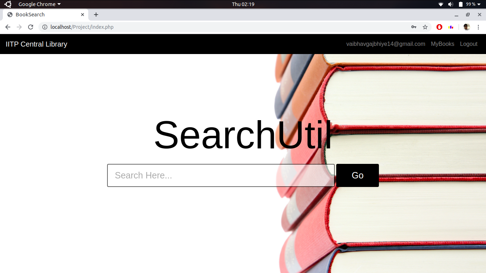

# IITP Central Library System

This PHP-MySQL based web application is made for the purpose of searching library
books intelligently and efficiently, letting the users sign up and log in to keep track of
their issued books and associated fine, and a separate portal for the librarian (library
admin) to issue books to the students, return the books and perform the fine
transaction to update the fine associated uniquely to every student by their email IDs.
Finding the library books is performed by inserting the information string associated
with the books in the search bar which could be the title, author, type, category, ISBN
no. or the unique “bookID” associated with every book. The inserted sentence is
broken down at the whitespaces into an array of words and then every word is
passed as a parameter to the “phpspellcheck” library that has been used, which
returns an array of suggested words, through which intelligent MySQL queries are
constructed to find these words as a substring of the data associated with the books.
This helps the user in finding the correct book, even when the input has a spelling
mistake.
There is a sign up and login page for library members and a login page for the library
admin (librarian). Signing in as a library member lets the user see their personal
details associated with their account and lets them modify their data in such a way
that the uniqueness of the email is maintained. Signing in also lets the user see their
currently issued books and total fine due on them which is calculated by finding the
difference of current date and return date of books in days, which if positive, gives the
net fine on when multiplied by 5 (as fine in our library is 5 INR per day).
Logging in as the admin lets the librarian perform the essential tasks associated with
a librarian which mainly are, issuing the books for the library members, returning the
books and performing the fine collection from them.
Issuing the books for the members requires the librarian to input the email of the
member and the bookID of the book which automatically saves the current date as
“issue date” and current date plus 30 days as the “return date”.
Returning the books from the members again requires the librarian to input the email
of the member and the bookID of the book through which the fine is calculated as the
difference of the current date and return date which if happens to be positive, is
added to the user with the inputted email after multiplying by five.
Fine Transaction just requires the librarian to enter the email of the library member
who has submitted the fine and the fine gets updated.

## Main Page

